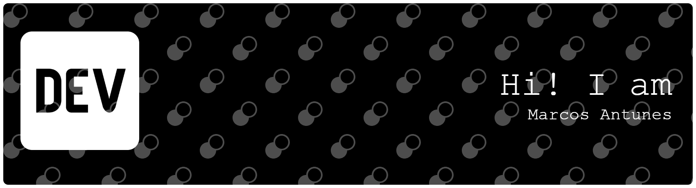

   

Olá! Sou estudante de Engenharia de Software na PUC Minas (Coreu). Estou construindo uma base sólida de conhecimentos teóricos, e meu maior objetivo atual é transformar esse aprendizado na construção de aplicações reais. Tenho um foco claro em me especializar no desenvolvimento back-end, explorando linguagens como Java e aprimorando a qualidade do código com testes. Trabalho todos os dias para evoluir minhas habilidades práticas, com a visão de longo prazo de me tornar um Engenheiro de Software de excelência.

<table aling="center">
  <tr>
    <td></td>
    <td></td>
  </tr>
</table>
